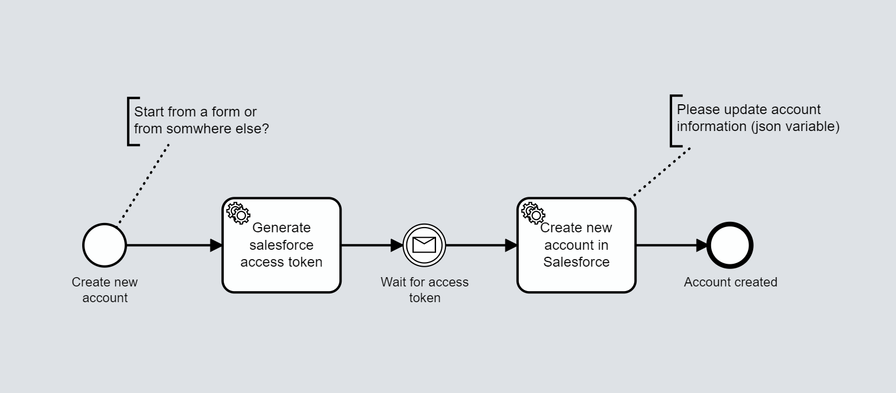

# Onify Blueprint: Create new Account in Salesforce via API

...

## Requirements

* Onify Hub v2
* Onify Flow license
* Camunda Modeler 4.4 or later 
* Salesforce

## Setup
...

#### Deploy

...

## Support

* Community/forum: https://support.onify.co/discuss
* Documentation: https://support.onify.co/docs
* Support and SLA: https://support.onify.co/docs/get-support

## License

This project is licensed under the MIT License - see the [LICENSE](LICENSE) file for details.
