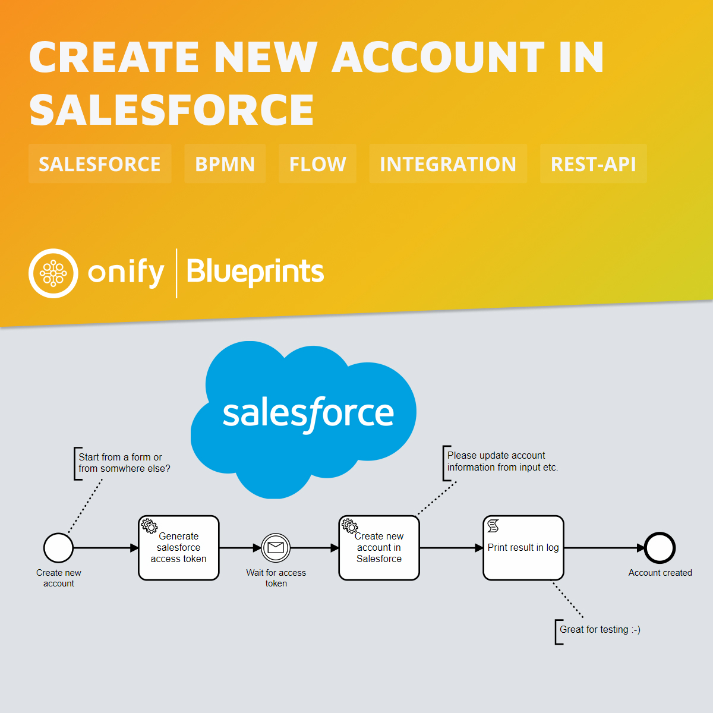

# Onify Blueprint: Create new Account in Salesforce via API

In this Blueprint we want to show how easy it is to create objects and in this case accounts in Salesforce. We use our own Blueprint ([Onify Blueprint: Generate access token for Salesforce API](https://github.com/onify/blueprint-salesforce-generate-access-token)) to fix the access and then you are ready to go. Salesforce has over 100 object types build in that you could either create, update or delete via their REST API. The only thing stopping you now is your imagination :-)

## Requirements

* Onify Hub API 2.3 or later
* Onify Flow license
* Camunda Modeler 4.4 or later 
* [Onify Blueprint: Generate access token for Salesforce API](https://github.com/onify/blueprint-salesforce-generate-access-token)
* Salesforce

## Setup

For testing purpose, no additional setup is required.

## Run 

1. Open `salesforce-create-account.bpmn` in Camunda Modeler
2. Click `Start current diagram`

## Support

* Community/forum: https://support.onify.co/discuss
* Documentation: https://support.onify.co/docs
* Support and SLA: https://support.onify.co/docs/get-support

## License

This project is licensed under the MIT License - see the [LICENSE](LICENSE) file for details.
